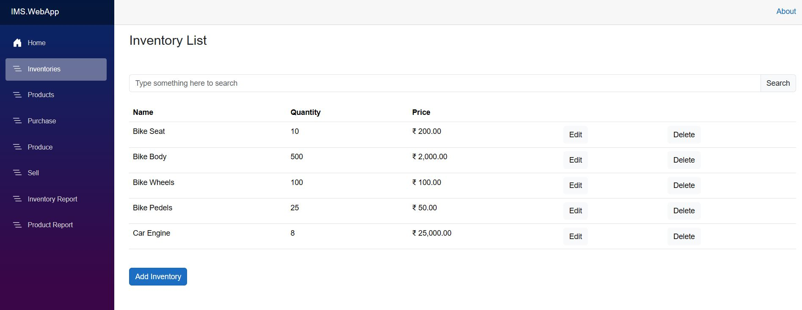
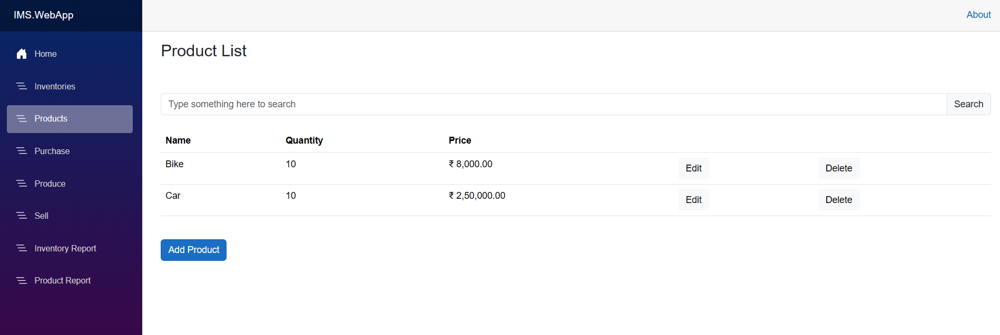
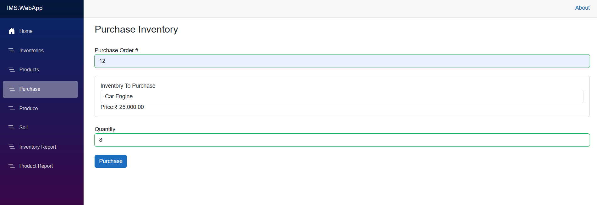
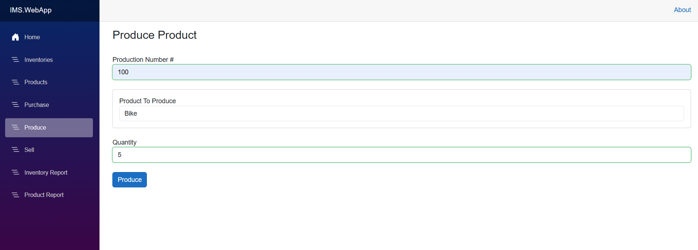
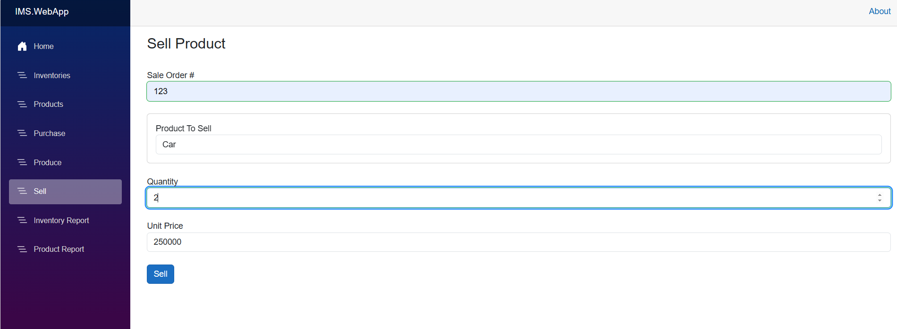
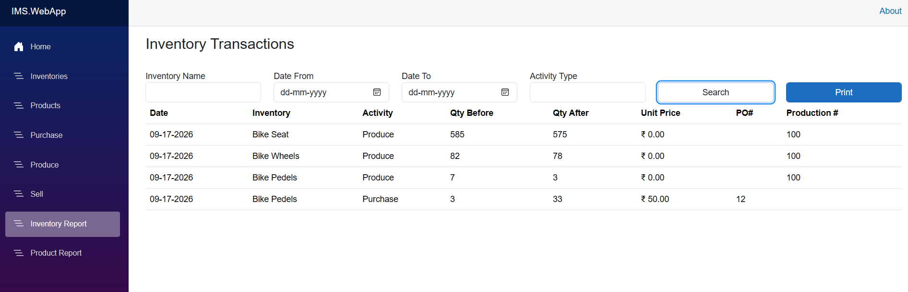
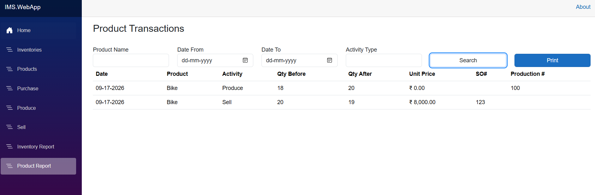

# Inventory Management System (IMS)

A production-shaped **Inventory & Production Management System** built with **Blazor** on **.NET 9**. It models a real manufacturing workflow: raw **inventories** are purchased, 
**consumed to produce products**, products are **sold**, and every stock movement is recorded as an auditable **transaction**.

Built with **Clean Architecture**, a **plugin-based** persistence layer (swap in-memory ↔ EF Core), and a live **Blazor Interactive Server (SignalR)** UI.

---

## Tech Stack

- **Frontend:** Blazor Web App (.NET 9) — Interactive Server render mode (SignalR)
- **Backend:** ASP.NET Core, C#
- **Architecture:** Clean Architecture — CoreBusiness · Use Cases · Plugins (InMemory + EFCore) · WebApp
- **Persistence:** EF Core (SQL Server / LocalDB) **and** an in-memory plugin — interchangeable
- **Validation:** System.ComponentModel.DataAnnotations + custom domain rules
- **UI:** Bootstrap 5, reusable Blazor components

---

## Architecture

- **Architecture:** Clean Architecture — CoreBusiness · Use Cases · Plugins (InMemory + EFCore) · WebApp
- The solution follows **Clean Architecture** — dependencies point **inward**, so the business logic never references the database or the UI.
- **Dependency Rule:** WebApp → Use Cases → CoreBusiness.
  Plugins implement the interfaces the Use Cases define, so the dependency is inverted — the persistence
  layer (InMemory for tests, EFCore for the real database) is chosen in `Program.cs` and can be swapped with a single line.

  ## Screenshots

### Inventory List


### Product List


### Purchase


### Produce


### Sell


### Inventory Transactions Report


### Product Transactions Report


---

## Key Features

- **Plugin-based persistence** — swap in-memory ↔ EF Core with one line in `Program.cs`
- **Use-case–driven** application layer (Clean Architecture interactors)
- **Blazor Interactive Server (SignalR)** — live UI, no full-page reloads
- **Bill-of-Materials domain** — produce consumes inventories; sell reduces product stock
- **Transaction-based auditing** — every movement logged with before/after quantities, date, and user
- **Filterable reports** — search transactions by name, date range, and activity type
- **DataAnnotations + custom validation** — e.g. a product's price must exceed its inventory cost

---

## Getting Started

**Prerequisites:** .NET 9 SDK, SQL Server LocalDB (ships with Visual Studio)

1. Clone the repo and open `IMS.sln` in Visual Studio.
2. Set the connection string in `appsettings.json`:
```json
   "ConnectionStrings": {
     "InventoryManagement": "Data Source=(localdb)\\MSSQLLocalDB;Initial Catalog=IMS;Integrated Security=True;Encrypt=False;Trust Server Certificate=True"
   }
```
3. Create the database (Package Manager Console):  
   Add-Migration init
   Update-Database
5. 4. Run the app (F5). The database is seeded with sample products and inventories.

---

## Learning Reference

This project was built while following:

**Learn Blazor, Entity Framework Core, and ASP.NET Core Identity, Clean Architecture for Full Stack Web Dev(.NET 10)
(https://www.udemy.com/course/learn-blazor-while-creating-an-inventory-management-system/learn/lecture/44277400#overview)** — Udemy

---

## Author

**Akshat Parasher**
- GitHub: https://github.com/AkshatAspNetCore
- GitLab: https://gitlab.com/arkhamknight95-group
- LinkedIn: https://www.linkedin.com/in/akshat-parasher-354a4363/
- Portfolio: https://akshat95-portfolio.netlify.app/
---

*Built with .NET 9, Blazor, EF Core, and Clean Architecture.*
